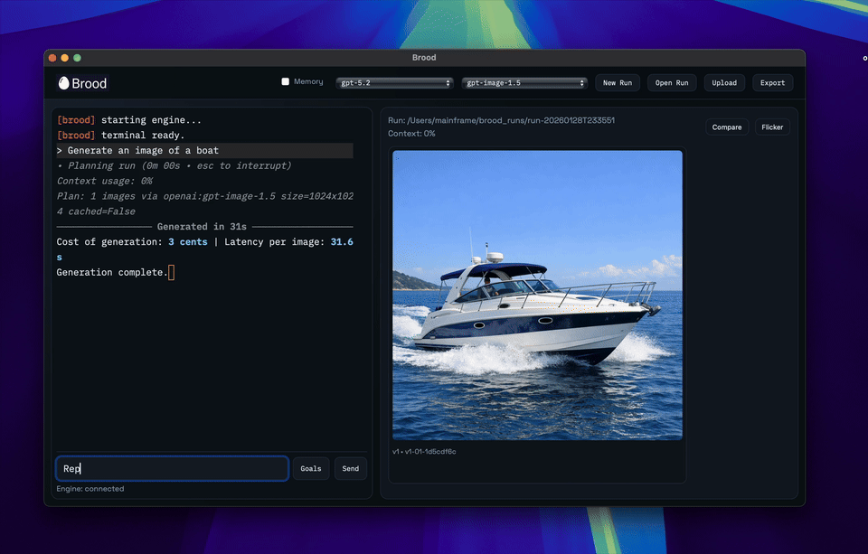

# Kevin Showkat

Portfolio of creative image-generation tools, evaluation/reporting workflows, and developer-first observability projects, plus a few product experiments.

**Keywords:** creative IDE, image generation, text-to-image, model evals, preference testing, run receipts, observability, OpenTelemetry, developer tools, product experiments

## Projects

- [Brood](https://github.com/kevinshowkat/brood)
  - Desktop creative IDE for image generation (PTY-backed chat + live canvas)
  - Preview: 

- [PARAM FORGE](https://github.com/kevinshowkat/param_forge)
  - Terminal UI (TUI) for text-to-image runs with reproducible receipts
  - Preview: 
  - Full video: [PARAM FORGE preview video](https://media.githubusercontent.com/media/kevinshowkat/param_forge/main/preview.mov)

- [oscillo-vision-reports](https://github.com/kevinshowkat/oscillo-vision-reports)
  - Pairwise preference reports for vision models (PDF + LaTeX snapshots)

- [superjumbo](https://github.com/kevinshowkat/superjumbo)
  - Sports prediction / picks web app (React + Django)
  - Wager Town on Product Hunt: [Product Hunt](https://www.producthunt.com/products/wager-town)

- [openllmetry](https://github.com/kevinshowkat/openllmetry) (fork)
  - OpenTelemetry instrumentation for LLM providers (Traceloop fork)

## Links

- LinkedIn: https://www.linkedin.com/in/kshowkat/
- Email: showkatkevin@gmail.com

