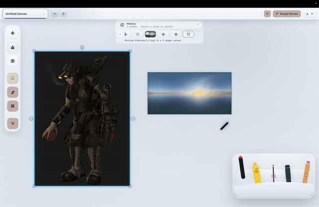

# Kevin Showkat

Image-first experiments: editors, evals, and receipts.

I build tools for screenshot-native editing, reference-driven workflows, and repeatable visual experimentation.

## Now Building

### [Cue](https://github.com/kevinshowkat/cue)
Image-first desktop design workstation in progress.

Cue focuses on screenshot-native edits, design review/apply, in-session tool creation, and exportable receipts.

  

Current public slice:
- shared canvas with session tabs
- single-image-first editing loop
- design review to in-place apply
- reusable tools and receipt-backed exports

## Shipped Tools

### [Brood](https://github.com/kevinshowkat/brood)
Shipped predecessor to Cue: reference-first AI image editing desktop for developers.

- [room-edit-lab](https://github.com/kevinshowkat/room-edit-lab) - creator-first room image edits, overlays, and vertical video assembly
- [param_forge](https://github.com/kevinshowkat/param_forge) - terminal UI for image-model experiments and reproducible receipts

## Public Evals

- [oscillo-vision-reports](https://github.com/kevinshowkat/oscillo-vision-reports) - public image-model preference reports and previews

## Archive / Other

- [superjumbo](https://github.com/kevinshowkat/superjumbo) - sports prediction game

## Elsewhere

- Landing page: https://kevinshowkat.github.io/
- LinkedIn: https://www.linkedin.com/in/kshowkat/
- Email: showkatkevin@gmail.com
