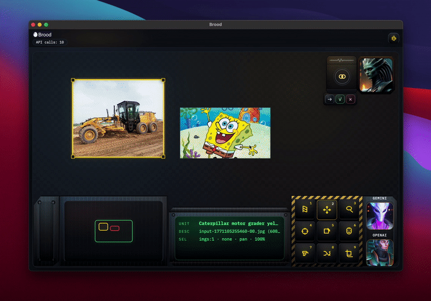

# Kevin Showkat

Public repos with shipped work and artifacts.

## Public Projects

### [Brood](https://github.com/kevinshowkat/brood)
Promptless, reference-first AI image editor for developers.

  

- [param_forge](https://github.com/kevinshowkat/param_forge) - Terminal UI for cross-provider image model experiments.
- [oscillo-vision-reports](https://github.com/kevinshowkat/oscillo-vision-reports) - Public image-model comparison reports.
- [superjumbo](https://github.com/kevinshowkat/superjumbo) - Free-to-play sports prediction game.

## Receipts
- Code
- Commits
- Releases
- Docs, tests, and artifacts (where included)

## Contact
- LinkedIn: https://www.linkedin.com/in/kshowkat/
- Email: showkatkevin@gmail.com

